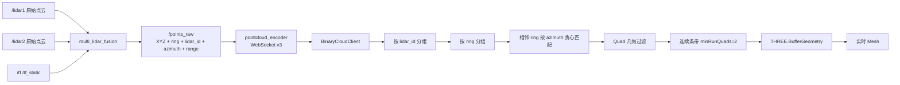
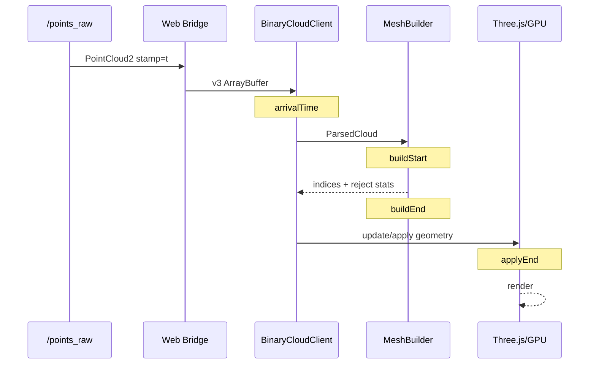
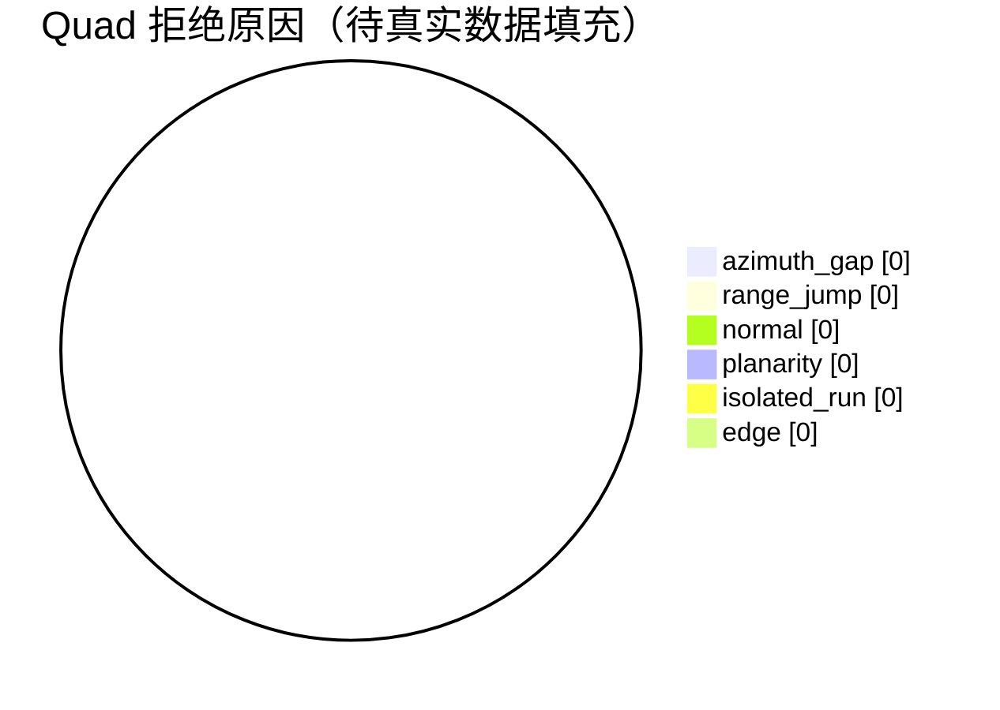

# 双 TM16 实时 Mesh 闪烁、空洞与低覆盖率诊断研究报告

**执行摘要：** 当前 `JBaien/Location` 的 `feature/realtime-cloud-mesh` 远端分支对应 PR #1，HEAD 为 `36505e9`；代码已经从基于时间的连面演进到基于 `lidar_id + ring + source azimuth + range` 的相邻扫描线构网，但仍缺少决定性诊断数据。fileciteturn2file0L3-L15  
从现有源码看，**最值得优先怀疑的已不是 Three.js 本身，而是扫描拓扑是否被正确恢复、过严的连续条带规则是否放大了孔洞，以及运行时是否仍有体素/点数截断/重复 `/points_raw` 发布**。当前代码只统计总 `rejectedTriangles`，没有记录具体拒绝原因，因此继续盲调阈值的收益很低。fileciteturn7file0L1-L7  
还有一个重要代码一致性风险：PR 描述称 `ring` 按垂直角排序，但实际融合节点只是 `dst.ring = src.ring`，驱动端又只是 `point.ring = p.ring_id`；因此**必须用真实 bag 验证 TM16 的 `ring_id` 是否确实按物理垂直角相邻**，否则“只连接 ring N 与 N+1”这一核心假设可能不成立。fileciteturn14file0L1-L2 fileciteturn20file0L1-L2  
建议下一阶段停止继续凭截图放宽边长门限，先完成 ≥100 帧的端到端统计与拒绝原因采样；拿到这些数据后，通常可以在一次实验中区分“输入拓扑问题”“过滤器过严”“前端帧替换问题”和“部署配置问题”。

## 已知上下文与代码基线

### 当前现场约束

根据你已经提供的现场信息，系统的目标不是离线重建或全局地图，而是**两台 TM16 激光雷达融合后的约 10 Hz 当前帧点云实时表面化**。当前关注的问题是顶板、底板和侧墙已有大量回波点，但前端 Mesh 仍表现为空洞、覆盖率低，并伴随一定程度的闪烁。

当前研究对象应锁定为：

| 项目 | 当前已知状态 | 需要最终实测确认 |
|---|---|---|
| 雷达 | 双 TM16 | 两台实际每帧点数、ring 数、ring 物理顺序 |
| 融合频率 | 约 10 Hz | `/points_raw` 实测 Hz、抖动 |
| ROS 输出 | `/points_raw` | 是否仅有一个 Publisher |
| WebSocket | 自定义二进制协议 v3 | 浏览器实际收到版本是否始终为 3 |
| v3 点字段 | `x y z intensity time azimuth range ring lidar_id` | fields mask 与每点有限值比例 |
| Mesh | Three.js indexed `BufferGeometry` | 每帧 CPU 构建、GPU 上传和替换耗时 |
| 体素 | 现场可能是 `0` 或 `0.05 m` | **必须读取实际 ROS 参数，而不能只看仓库 YAML** |
| 点数上限 | `200000` | 是否有任何帧触发硬截断 |
| 部署 | Docker/Compose 或 `npm run dev` | 现场实际加载哪一套配置和 JS |

远端 PR #1 目前仍为 open，HEAD 为 `36505e9551...`，PR 说明明确记录了 v3 协议、source-lidar `azimuth/range`、按 `lidar_id` 分开建面、禁止跨雷达直接连面以及低覆盖帧暂存等设计。fileciteturn2file0L3-L15

### 当前协议与数据链

当前 `BinaryCloudClient.ts` 支持 v1/v2/v3；协议头为 24 字节，v3 每个点 32 字节，并从点中读取 `time`、`azimuth`、`range`、`ring`、`lidar_id`。只有 v3 才具有独立的 `azimuth/range` 字段。fileciteturn8file0L1-L7

这里需要严格区分两个概念：

**`/points_raw` 本身没有“v1/v2/v3”。** `/points_raw` 是 ROS `sensor_msgs/PointCloud2`；PointCloud2 通过 `fields` 描述二进制 blob 内每个字段的布局。v1/v2/v3 是本项目在 ROS → WebSocket 编码后加在 `CloudPacketHeader.version` 中的自定义协议版本。ROS 官方 PointCloud2 工具也以字段名称和字段类型访问这种二进制点数据。citeturn1search1

因此后面的“100 帧二进制样本”实际应该同时保存：

```text
ROS PointCloud2 /points_raw
       │
       ├── stamp
       ├── fields[]
       └── binary data
              │
              ↓
pointcloud_encoder
              │
              ↓
WebSocket CloudPacket
       ├── version = 1/2/3
       ├── stamp_ns
       ├── point_count
       ├── fields_mask
       └── WebPoint[]
```

两者通过时间戳关联，而不是把 ROS PointCloud2 本身称作 v3。当前编码器正是从 PointCloud2 的字段表中查找 `lidar_id/ring/time/azimuth/range` 后生成 fields mask。fileciteturn12file0L1-L7

### 当前 Mesh 算法实际上在做什么

`ScanMeshLayer` 当前调用的是 `buildStableScanMesh()`，而不是旧的基于 `time` 的 `ScanMeshBuilder`。它要求 `lidar_id + ring + azimuth` 存在，然后按雷达分组、按 ring 分组，再只连接相邻物理 ring。fileciteturn9file0L1-L7 fileciteturn7file0L1-L7

当前核心逻辑为：



当前 builder 的默认条件并不宽松：匹配容差动态限制在约 `0.12°–0.65°`，连续方位角间隔上限限制在约 `0.35°–1.20°`，只连接 `ring` 差值恰好等于 1 的扫描线，并进一步检查沿 ring 边长、跨 ring 边长、对角线、量程跳变、对边方向、对边长度比、三角形法向、平面误差以及连续条带法向。fileciteturn7file0L1-L7 fileciteturn17file0L1-L7 fileciteturn18file0L1-L7

这套过滤可以阻止以前截图中的“巨型悬空三角形”，但它也具备明显的**孔洞放大效应**：`minRunQuads=2`，一旦中间某一个候选四边形无效，就会执行 `flushRun()`；长度不足 2 的前后短 run 都不会输出。也就是说，一个局部缺点可能不仅损失一个 quad，还可能把它两侧本来合法但孤立的 quad 一起删除。fileciteturn7file0L1-L7

这与现在看到的“点明明很多，面却成片缺失”高度相符，但在拿到拒绝原因统计前只能列为**高概率假设，不能作为最终结论**。

### 当前渲染策略

`ScanMeshLayer` 使用半透明 `MeshBasicMaterial`，设置了 `DoubleSide`、`depthTest=true`、`depthWrite=true`、polygon offset，并把透明双面材质设为 `forceSinglePass=true`。Three.js 官方文档说明 `depthWrite` 控制是否写深度缓冲，而 `forceSinglePass` 会让透明双面材质改用单 pass；这些设置本身是合法的渲染配置。fileciteturn9file0L1-L7 citeturn2view1

当前每次应用新帧时会：

```text
new BufferGeometry()
new Float32Array(color)
set position
set color
set index
切换 mesh.geometry
重新遍历所有点 recolor
dispose 旧 geometry
```

而不是复用固定容量的 GPU buffer。fileciteturn9file0L1-L7 Three.js 的 `BufferGeometry` 本来就是把 position/index/color 等放进 GPU buffer；不再使用时调用 `dispose()` 是正确做法，但每个 10 Hz 帧都创建新的 geometry 和 TypedArray 仍可能引入 CPU 分配、GC 和 GPU 上传抖动。citeturn2view0

当前还有一个低覆盖帧保护：

```text
lowCoverageRatio      = 0.30
minimumTriangleFloor  = 64
maxHoldDurationMs     = 900
```

候选 Mesh 突然掉到当前显示三角形数的 30% 以下时，最长保留上一帧 900 ms。fileciteturn9file0L1-L7 这能掩盖极端空帧，却不能解决“每帧都有 Mesh，但不同位置不断缺块”的拓扑闪烁。

### 一个必须特别验证的代码矛盾

PR 文本写的是“按垂直角排序的 `ring`”，但当前融合代码没有看到垂直角排序过程，而是直接：

```cpp
dst.ring = src.ring;
```

fileciteturn14file0L1-L2

而 TM 驱动发布时又只是：

```cpp
point.ring = p.ring_id;
```

fileciteturn20file0L1-L2

因此，在真实设备上**绝不能直接假定**：

```text
ring 4
与
ring 5
```

一定就是空间上相邻的两条垂直激光束。

这个验证非常重要。如果 TM16 SDK 的通道编号不是按照垂直仰角递增，那么当前算法的：

```ts
if (upper.ring - lower.ring !== 1) continue;
```

从拓扑基础上就是错误的。当前 builder 确实采用了这个判断。fileciteturn7file0L1-L7

最直接的验证办法不是查文档猜测，而是利用 5 秒原始 bag，对每个 `lidar_id × ring` 计算：

\[
elevation = \operatorname{atan2}(z,\sqrt{x^2+y^2})
\]

然后取每个 ring 的 elevation 中位数，检查：

```text
ring_id       median elevation
0             ?
1             ?
2             ?
...
15            ?
```

如果 elevation 不随 ring 单调变化，就必须建立：

```text
raw_ring_id → vertical_order
```

映射。

## 需要验证与收集的数据

下面的数据应当成为下一次修改前的**最小诊断集**。ROS bag 本身非常适合这一用途；ROS 官方 rosbag API支持按 topic 和时间范围读取消息。citeturn1search2turn1search6

| 数据 | 最低要求 | 目的 | 关键检查 |
|---|---:|---|---|
| 原始双雷达 rosbag | ≥5 秒 | 重放真实扫描结构 | 两个原始点云 topic、`/tf`、强烈建议 `/tf_static`、`/clock` 若存在 |
| 连续融合帧 | ≥100 帧 | 做帧间统计 | `/points_raw` fields、point count、stamp |
| WebSocket 原始包 | ≥100 包 | 验证 v3 与传输完整性 | header.version、point_count、fields_mask、stamp_ns |
| 每帧 point count | 每帧 | 判断限幅/丢帧 | raw points 与 Web encoded points 比值 |
| 每 ring 点数 | 每帧每 lidar | 判断扫描线缺失 | min/p10/median/max |
| azimuth 分布 | 每 ring | 判断扫描列间隔 | histogram、median Δazimuth、最大 gap |
| elevation/ring 对应 | 原始双雷达 | 验证物理 ring 顺序 | ring ID 是否按垂直角单调 |
| range 分布 | 每 ring | 判断掠射与遮挡 | p10/p50/p90、连续 range jump |
| azimuth 匹配统计 | 每相邻 ring pair | 判断配对器是否过严 | matched / possible |
| Quad 拒绝原因 | 每帧 | 找到真正杀伤最大的 gate | edge、range、normal、planarity、isolated 等 |
| Mesh triangle count | 每帧 | 定量评估闪烁 | mean/std/min/max |
| 点覆盖率 | 每帧 | 定量评估“有点无面” | 被三角形引用点 / 可构网点 |
| 构建耗时 | 每帧 | 查主线程卡顿 | builder、color、geometry apply 分开计时 |
| 包到达间隔 | 每包 | 区分数据闪烁与网络闪烁 | `performance.now()` delta |
| 配置快照 | 每次实验 | 防止实验失真 | voxel、rate、max_points、topic、transform |
| Publisher 列表 | 每次实验 | 排除新旧数据混流 | `/points_raw` Publisher 必须明确 |

有一个数量上的现实问题：**5 秒 × 10 Hz 只有约 50 帧**。因此，5 秒 bag 可以作为最小几何复现样本，但若要求至少 100 个**独立连续帧**做波动统计，建议录 **12 秒左右**。不要简单把 5 秒 bag loop 两遍后把循环边界算进帧间稳定性统计，因为 bag 回卷会人为制造一次时间与场景跳变。

### 必须同时保存的字段

对于融合后的 `/points_raw`：

```text
x
y
z
intensity
ring
lidar_id
time
azimuth
range
```

当前 fusion 确实会在 TF 之前根据各自雷达坐标系中的 XYZ 计算 `source_azimuth` 和 `source_range`，然后才把 XYZ 变换到输出坐标系。fileciteturn14file0L1-L2

对于 WebSocket 包，则还要保存：

```text
version
cloud_type
stamp_ns
point_count
fields_mask
byteLength
arrivalPerformanceNow
```

当前浏览器解析器使用 `binaryType='arraybuffer'` 并直接通过 `DataView` 读取。浏览器 WebSocket API正式支持以 `ArrayBuffer` 接收二进制消息。fileciteturn8file0L1-L7 citeturn0search2

### 当前运行配置必须采集两份

不能只把仓库中的 YAML 当作现场配置。

仓库普通 Web 配置当前是：

```yaml
current_cloud:
  send_rate_hz: 0.0
  voxel_size_m: 0.0
  max_points: 200000
  transform_body_to_map: true
```

并且默认订阅 `/cloud_registered_body`。fileciteturn10file0L1-L7

ZF runtime 则是：

```yaml
topics:
  current_cloud: /points_raw

current_cloud:
  send_rate_hz: 0.0
  voxel_size_m: 0.0
  max_points: 200000
  transform_body_to_map: false
```

fileciteturn11file0L1-L7

而 Docker Compose 把宿主机的：

```text
./runtime
```

直接挂载为：

```text
/config
```

所以现场外挂配置会成为真正的运行配置。fileciteturn23file0L1-L7

因此每次实验都同时记录：

```bash
cat /config/web/web_viewer.yaml
```

和：

```bash
rosparam get /web_viewer/current_cloud
rosparam get /web_viewer/topics/current_cloud
```

实际 ROS 参数优先级高于“你记得配置是多少”。

## 研究方法与可复现流程

### 建立可重复的基准 bag

先确认原始话题：

```bash
rostopic list | grep -E 'lidar1|lidar2|points|tf|clock'
```

然后录制。假设原始点话题为 `/lidar1/timoo_points` 与 `/lidar2/timoo_points`：

```bash
timeout --signal=INT 12s rosbag record \
  -O tm16_mesh_diag_12s.bag \
  /lidar1/timoo_points \
  /lidar2/timoo_points \
  /tf \
  /tf_static \
  /clock \
  /points_raw
```

如果现场没有 `/clock`，去掉它即可。重点是原始双雷达点云和 TF 不能缺，因为一旦只有旧 `/points_raw`，就无法独立验证 fusion 之前的 ring/elevation/azimuth 关系。

录完先执行：

```bash
rosbag info tm16_mesh_diag_12s.bag
```

确认两个原始 topic 都至少有约百帧。

### 重放时避免旧 `/points_raw` 与新 fusion 混流

调试新 fusion 时，**不要从 bag 回放 bag 中保存的 `/points_raw`**。

使用：

```bash
rosparam set use_sim_time true

rosbag play --clock tm16_mesh_diag_12s.bag \
  --topics \
  /lidar1/timoo_points \
  /lidar2/timoo_points \
  /tf \
  /tf_static
```

与此同时运行当前分支的 fusion，让它生成新的 `/points_raw`。

然后：

```bash
rostopic info /points_raw
```

记录 `Publishers:`。

最理想的诊断状态是：

```text
/points_raw
    Publisher 只有当前 multi_lidar_fusion
```

若 bag 也在发布旧 `/points_raw`，因为两个消息在 ROS 类型层面都属于 `sensor_msgs/PointCloud2`，但内部 fields 可以不同，Web Bridge 就可能交替收到不同字段布局。PointCloud2 的字段布局本来就是由消息自己的 `fields` 数组定义的。citeturn1search1

这种情况足以造成：

```text
v3 可成面帧
→ 旧字段帧
→ v3 可成面帧
→ 旧字段帧
```

从而产生非常典型的闪烁。

### 检查 `/points_raw` 数据质量

首先：

```bash
rostopic echo -n 1 /points_raw/fields
```

必须看到：

```text
x
y
z
intensity
time
azimuth
range
ring
lidar_id
```

然后：

```bash
rostopic hz /points_raw
```

至少观察 30 秒，记录：

```text
average rate
min
max
std dev
window
```

再确认实际参数：

```bash
rosparam get /web_viewer/topics/current_cloud
rosparam get /web_viewer/current_cloud
```

### 检查 `max_points=200000` 是否正在偷偷截断

这是当前代码中一个容易忽视的点。

`VoxelLimiter::accept()` 即使：

```text
voxel_size_m <= 0
```

也仍然会检查：

```cpp
accepted_count_ >= max_points_
```

一旦达到 `max_points`，后面的点全部拒绝。fileciteturn13file0L1-L7

编码器也是逐点调用 limiter，然后把接受的点 push 到输出。fileciteturn12file0L1-L7

所以：

```yaml
voxel_size_m: 0.0
```

并不等价于：

```text
所有点必定进入浏览器
```

只有：

```text
raw_points <= max_points
```

才成立。

必须每帧记录：

\[
R_{cap} = \frac{encoded\_points}{raw\_points}
\]

Mesh 诊断阶段的目标应是：

```text
Rcap = 1.000
```

如果频繁恰好：

```text
encoded_points = 200000
```

就说明 Mesh 输入已经发生硬截断。

因为 fusion 是把多台雷达点合入一个输出云，若硬截断发生在顺序遍历阶段，还可能使帧尾部数据受到不均匀影响；这一点需要通过 `lidar_id` 分别统计编码前后点数来验证。编码器和 limiter 的现有结构支持这一风险判断。fileciteturn12file0L1-L7 fileciteturn13file0L1-L7

### 统计 ring、azimuth 与真实物理扫描结构

对于每一个：

```text
frame × lidar_id × ring
```

统计：

```text
point_count
azimuth_min
azimuth_max
median_delta_azimuth
p90_delta_azimuth
max_delta_azimuth
range_p10
range_p50
range_p90
```

对**原始双雷达 topic**还额外统计：

```text
median_elevation
```

其中：

```python
azimuth = atan2(y, x)
elevation = atan2(z, hypot(x, y))
range = sqrt(x*x + y*y + z*z)
```

生成的关键 CSV 应类似：

```text
frame,lidar_id,ring,points,median_el_deg,median_daz_deg,p90_daz_deg,max_gap_deg,range_p50
0,0,0,...
0,0,1,...
...
0,1,15,...
```

尤其画出：

```text
ring_id → median elevation
```

如果出现：

```text
ring 0  = -5°
ring 1  = +7°
ring 2  = -3°
ring 3  = +5°
...
```

则当前：

```ts
upper.ring - lower.ring === 1
```

不能代表垂直相邻线束，需要先重排 ring。当前驱动只是沿用 SDK 的 `ring_id`，fusion 同样直接保留它，所以这一验证是强制性的。fileciteturn20file0L1-L2 fileciteturn14file0L1-L2

### 给 Mesh Builder 加“拒绝原因”而不是只计总数

这是本轮研究最关键的代码改动。

当前：

```ts
interface QuadEvaluation {
  valid: boolean;
  normalX: number;
  normalY: number;
  normalZ: number;
}
```

所有失败路径最终都只是：

```ts
return invalidQuad();
```

而公开结果只有：

```ts
rejectedTriangles
```

无法知道到底是哪个规则删除了大部分顶板/底板。fileciteturn17file0L1-L7 fileciteturn18file0L1-L7

建议改成：

```ts
export type QuadRejectReason =
  | 'duplicate_vertex'
  | 'invalid_vector'
  | 'azimuth_gap'
  | 'along_edge'
  | 'cross_edge'
  | 'diagonal_edge'
  | 'range_jump'
  | 'opposite_edge_angle'
  | 'opposite_edge_ratio'
  | 'triangle_degenerate'
  | 'triangle_edge_ratio'
  | 'triangle_normal'
  | 'planarity'
  | 'run_normal'
  | 'isolated_run';

interface QuadEvaluation {
  valid: boolean;
  reason: QuadRejectReason | 'accepted';
  normalX: number;
  normalY: number;
  normalZ: number;
}
```

并增加：

```ts
const rejects: Record<string, number> = {};

function reject(reason: QuadRejectReason): QuadEvaluation {
  rejects[reason] = (rejects[reason] ?? 0) + 1;
  return {
    valid: false,
    reason,
    normalX: 0,
    normalY: 0,
    normalZ: 0
  };
}
```

不要对每一个拒绝 quad 都无条件 `console.log`，否则日志本身会拖慢浏览器。建议每帧只采样前 20～50 个详细案例：

```ts
if (debugSamples.length < 32) {
  debugSamples.push({
    reason,
    lidarId,
    lowerRing,
    upperRing,
    lower0: {
      azimuth: cloud.azimuths[lower0],
      range: cloud.ranges[lower0]
    },
    upper0: {
      azimuth: cloud.azimuths[upper0],
      range: cloud.ranges[upper0]
    },
    lower1: {
      azimuth: cloud.azimuths[lower1],
      range: cloud.ranges[lower1]
    },
    upper1: {
      azimuth: cloud.azimuths[upper1],
      range: cloud.ranges[upper1]
    }
  });
}
```

这样才能回答目前最重要的问题：

> 顶板没有成面，到底是因为没有 azimuth match，还是因为 range jump、normal、planarity 或 isolated-run 被拒绝？

### 单独测量构网、着色与 Geometry 应用

当前 `ScanMeshLayer.updateCloud()` 同步执行 `buildStableScanMesh()`，然后可能进一步创建新 geometry 和颜色数组。fileciteturn9file0L1-L7

改成：

```ts
const t0 = performance.now();
const candidate = buildStableScanMesh(cloud);
const t1 = performance.now();

this.applyCloud(cloud, candidate, mode, reflectorVisible);
const t2 = performance.now();

debug.meshBuildMs = t1 - t0;
debug.meshApplyMs = t2 - t1;
debug.meshTotalMs = t2 - t0;
```

`performance.now()` 是浏览器提供的高分辨率单调计时接口，很适合测这种几十毫秒级前端阶段耗时。citeturn2view5

最好进一步把：

```text
applyCloud
```

拆成：

```text
geometryAllocationMs
positionIndexSetupMs
recolorMs
bufferSwapMs
```

因为当前 `recolor()` 会对整帧所有点再次遍历。fileciteturn9file0L1-L7

### 做受控参数矩阵，不再一次改多个条件

至少跑以下矩阵，每组使用**同一段 bag、相同相机视角、相同起止帧**：

| 实验 | voxel | 方位角拓扑 | 缺列策略 | ring 策略 | 目的 |
|---|---:|---|---|---|---|
| A | 0 | 当前 azimuth match | 禁跨 | N↔N+1 | 当前基线 |
| B | 0.05 | 当前 azimuth match | 禁跨 | N↔N+1 | 定量测 voxel 破坏 |
| C | 0 | 固定 720 列 | 禁跨 | N↔N+1 | 与旧固定列法对照 |
| D | 0 | azimuth 公共网格 | 禁跨 | N↔N+1 | 测试 range-image grid |
| E | 0 | azimuth 公共网格 | 允许跨 1 列 | N↔N+1 | 测试小缺点恢复 |
| F | 0 | azimuth 公共网格 | 禁跨 | **按 elevation 重排后的相邻 ring** | 验证 ring 顺序假设 |
| G | 0 | 当前算法 | 禁跨 | N↔N+1，`minRunQuads=1` | 定量测试孤立 run 放大孔洞 |
| H | 0 | 当前算法 | 禁跨 | N↔N+1，`minRunQuads=2` | 与 G 对照 |

这里最值得关注的是 **A vs G** 和 **A vs F**。

如果：

```text
minRunQuads=1
```

让点覆盖率从例如 45% 显著升到 80% 以上，同时错误跨面并没有明显增加，那么当前的 `minRunQuads=2` 就是主要覆盖杀手之一。

如果只有“按 elevation 排序 ring”后覆盖率突然明显提升，则根因在 scan channel topology，而不是几何门限。

### 测试 WebSocket 与帧保持策略

WebSocket 本身接收二进制 `ArrayBuffer` 没问题；实际需要测的是**包到达间隔、主线程阻塞和是否发生应用层丢帧**。citeturn0search2

前端记录：

```ts
const arrival = performance.now();
const previousArrival = this.lastArrival;
this.debug.interArrivalMs = arrival - previousArrival;
this.lastArrival = arrival;
```

再记录：

```text
packet stamp_ns
arrival time
mesh build start/end
geometry apply start/end
render frame time
held/applied/cleared
```

建议时序日志：



网络延迟测试可在 Linux 上用 `tc netem`：

```bash
sudo tc qdisc add dev eth0 root netem delay 100ms 20ms
```

结束：

```bash
sudo tc qdisc del dev eth0 root
```

若要模拟“整个 WebSocket 点云帧被丢弃”，比模拟底层 TCP packet loss 更可控的做法是在调试版前端直接随机跳过完整消息：

```ts
const dropProbability = 0.10;

if (Math.random() < dropProbability) {
  debug.droppedForTest += 1;
  return;
}
```

再分别测试：

```text
hold = 0 ms
hold = 300 ms
hold = 900 ms
hold = 1500 ms
```

比较 Mesh 三角形波动和视觉停滞。

## 诊断指标与判据

下面的阈值应理解为**本项目的工程验收目标**，不是 TM16 厂商规范。真正有价值的是同一 bag 下不同策略之间的可重复对比。

| 指标 | 定义 | 建议目标 | 超标时优先怀疑 |
|---|---|---:|---|
| Mesh 点覆盖率 | Mesh 中出现过的唯一顶点 / 可构网回波点 | **>80%** | ring/azimuth 匹配或过滤器过严 |
| Candidate quad 覆盖率 | accepted quad / 基础候选 quad | **>80%** | 几何 gate |
| 每 ring 平均点数 | 每帧每 ring point count | **>4** 最低 sanity check | 输入缺失/体素/截断 |
| 四边形拒绝率 | rejected / evaluated | **<20%** | 某项阈值不适配真实扫描 |
| 帧间三角形波动 | `std(T)/mean(T)` | **<0.20** | 输入不稳或 topology 不稳定 |
| triangle collapse 帧 | `Tt < 0.3 × Tdisplay` | 趋近 0 | 输入/配对失效 |
| Mesh build mean | builder CPU | **<50 ms** | JS 算法过重 |
| Mesh build p95 | builder CPU | 建议 <70 ms | 偶发 GC/复杂帧 |
| 全前端 Mesh pipeline | build+color+apply | 建议 <80 ms | 赶不上 10 Hz |
| Web 包到达间隔 | inter-arrival | 接近 100 ms | Web Bridge/网络 |
| 协议版本 | Web header.version | **100% v3** | 新旧服务混用 |
| v3 拓扑字段有效率 | finite `azimuth/range` | **≈100%** | fusion/encoder |
| 编码保留率 | encoded/raw | **1.0** | voxel 或 max_points |
| `/points_raw` publishers | Publisher 数 | **1 个预期源** | bag+fusion 混流 |
| ring elevation 单调性 | ring 与 median elevation | 必须解释清楚 | raw ring 编号不是物理顺序 |

其中“每 ring >4”只能作为极低级别异常检测。真正应关注的是：

```text
p10 ring points
median ring points
ring-to-ring imbalance
frame-to-frame variation
```

因为一个 ring 平均有很多点，并不能保证某个顶板方位区间中没有长缺口。

### 覆盖率不要只用 triangle count

单纯比较：

```text
triangle_count
```

容易误判。

一个错误的大三角形可能“面积巨大”，但实际上质量很差；相反，很多窄而正确的 TM16 三角条带可能 triangle count 很高但仍有局部孔洞。

建议至少同时输出：

\[
C_{point}
=
\frac{\text{被至少一个三角形引用的可构网点数}}
{\text{全部可构网点数}}
\]

以及：

\[
C_{quad}
=
\frac{\text{Accepted Quads}}
{\text{Basic Candidate Quads}}
\]

再按照：

```text
lidar_id
ring pair
azimuth sector
```

分桶。

最终最有诊断价值的表格应该类似：

| lidar | ring pair | azimuth sector | candidates | accepted | coverage | top reject |
|---:|---|---|---:|---:|---:|---|
| 0 | 3–4 | 30°–40° | … | … | … | planarity |
| 0 | 4–5 | 30°–40° | … | … | … | isolated_run |
| 1 | 7–8 | 120°–130° | … | … | … | azimuth_match |

这样才能直接把屏幕上的洞定位回算法条件。

## 根因优先级与修复建议

### 最高优先级：ring 的“物理相邻”假设尚未被真实数据证明

这是目前代码审查发现的最重要风险之一。

当前前端只接受：

```ts
upper.ring - lower.ring === 1
```

fileciteturn7file0L1-L7

但 fusion 没有执行明显的 ring 垂直角排序，只把源 `ring` 复制过去；源驱动也直接采用 SDK 的 `ring_id`。fileciteturn14file0L1-L2 fileciteturn20file0L1-L2

**修复方式：**

先从真实 raw bag 得到：

```text
ring_id → median vertical angle
```

若顺序不是单调的，在 fusion 或 driver 中建立：

```cpp
static constexpr uint16_t ring_order[16] = {
    ...
};
dst.ring = ring_order[src.ring];
```

更理想的是新增：

```text
raw_ring
scan_ring
```

保留原始 channel，同时给 Mesh 使用 `scan_ring`。

**预期效果：** 如果当前 ring 顺序确实错误，这会是覆盖率提升最大的一项。

**风险：** 没有真实数据确认前不能硬编码映射；不同 TM16 firmware/calibration 可能不同。

### 最高优先级：当前过滤器没有原因统计，无法科学调参

当前 `evaluateQuad()` 的多种失败条件最终都变成同一个 `invalidQuad()`，UI 只知道总拒绝数量。fileciteturn17file0L1-L7 fileciteturn18file0L1-L7

这意味着目前任何“再把 normal 从 28° 放到 40°”之类调整都属于盲调。

**修复方式：**

优先引入：

```text
RejectReason
reject counters
sampled rejected quads
per-ring-pair counters
```

**预期效果：** 它本身不会增加覆盖，但能把后续调试从“截图猜测”变成一到两轮可量化实验。

**风险：** 低；只需避免大量 console 输出影响性能。

### 很高优先级：`minRunQuads=2` 很可能在放大局部缺点

当前一个候选四边形失败会 flush run，而不足两个 quad 的 run 会被整个删除。fileciteturn7file0L1-L7

例如真实序列：

```text
合法    缺一个点    合法
 Q0       X         Q2
```

在当前策略下可能得到：

```text
run=[Q0] → 删除
X
run=[Q2] → 删除
```

结果就是：

```text
一个局部缺点
↓
三个位置都没有表面
```

对于 16 线雷达在顶板/底板掠射区域，这种放大机制尤其值得实测。

**修复方式：**

先做 A/B：

```ts
minRunQuads: 1
```

与：

```ts
minRunQuads: 2
```

比较“错误面数量”和“点覆盖率”。

长期更好的方案不是简单设 1，而是：

```text
孤立 quad
+
邻域平面支持
+
两侧 range continuity
```

成立时允许输出，而不是用 run 长度作为唯一结构支持条件。

**预期效果：** 大幅降低规则条带型孔洞。

**风险：** 可能重新引入少量孤立错误面，需要配合 planarity/range gate。

### 很高优先级：voxel 与 max_points 必须确认实际运行值

ZF 分支当前 YAML 是：

```yaml
voxel_size_m: 0.0
max_points: 200000
```

fileciteturn11file0L1-L7

但 Compose 把宿主机 runtime 覆盖进 `/config`。fileciteturn23file0L1-L7 因此现场仍可能实际运行 `0.05`。

若：

```text
voxel_size_m = 0.05
```

即使 voxel key 已经包含 `lidar_id/ring` 分组，它仍会删除同一 ring 内落入相同空间 voxel 的点，直接改变 azimuth 序列。编码器当前确实把 `lidar_id/ring` 组合成 topology group 后交给 limiter。fileciteturn12file0L1-L7

**修复方式：**

Mesh 基准实验固定：

```yaml
send_rate_hz: 0.0
voxel_size_m: 0.0
max_points: 300000
```

前提是实测单帧内存和网络可承受。

同时记录：

```text
raw_points
encoded_points
```

**预期效果：** 排除 Web Bridge 对扫描拓扑的二次破坏。

**风险：** WebSocket 带宽与浏览器解析量上升。

### 高优先级：200000 点上限可能导致“无 voxel 仍丢点”

当前 limiter 明确先检查：

```cpp
accepted_count_ >= max_points_
```

达到限制后直接拒绝后续点。fileciteturn13file0L1-L7

因此只看：

```yaml
voxel_size_m: 0
```

不足以证明输入完整。

**修复方式：**

诊断阶段：

```yaml
max_points: 300000
```

或至少先统计：

```text
max(raw_points)
```

确保：

```text
max(raw_points) < 200000
```

再恢复生产限制。

**预期效果：** 若当前确实撞 cap，可消除被截掉的大片扫描区域。

**风险：** 带宽增加。v3 每点为 32 字节，仅点 payload 在 200000 点时约 6.4 MB/帧；10 Hz 理论原始 payload 已非常可观，因此需要实测实际点数，而不能无条件无限调高。v3 的 32 字节点布局可由当前解析器直接确认。fileciteturn8file0L1-L7

### 高优先级：azimuth greedy matching 可能仍然损失有效对应

当前相邻 ring 的匹配是两个排序数组的贪心一对一扫描。满足 tolerance 后，它还会查看下一点是否更近，然后推进索引。fileciteturn17file0L1-L7

这比按 `time` 恢复列可靠得多，但如果不同 ring 存在：

```text
恒定方位偏移
非完全相同采样角
局部缺点
双回波
```

一对一 greedy matching 仍可能造成某些连续区域匹配比例偏低。

**修复建议：公共 azimuth range-image 网格。**

例如估计本帧原生角分辨率：

```text
Δθ ≈ median per-ring azimuth step
```

然后：

```ts
column = Math.round(normalizeAngle(azimuth - frameOrigin) / deltaAzimuth);
```

建立：

```text
grid[lidar][ring][column] = point
```

连面直接变为：

```text
(r,c)
(r+1,c)
(r,c+1)
(r+1,c+1)
```

允许：

```text
c → c+2
```

这种“一列缺点恢复”时，也能清楚控制，而不是依赖四个点各自的 greedy match。

**预期效果：** 更稳定的帧间 topology；triangle indices 的结构变化更小。

**风险：** 必须正确估计相位 origin 和 Δazimuth；不能重新退回固定 720 列这种与真实扫描分辨率无关的硬编码。

### 中优先级：0/360° 边界匹配存在潜在 seam

当前 ring 排序把 azimuth 归一到 `[0, 2π)` 后排序，但跨 ring 的 `matchRingSequences()` 使用普通：

```ts
lowerAngle - upperAngle
```

进行比较，而不是圆周最短角距离。fileciteturn17file0L1-L7

因此：

```text
ring A = 359.9°
ring B =   0.1°
```

实际上只差：

```text
0.2°
```

普通减法却接近：

```text
359.8°
```

这会在扫描切线附近形成固定 seam。

**修复方式：**

定义：

```ts
function signedCircularDelta(a: number, b: number): number {
  return Math.atan2(Math.sin(a - b), Math.cos(a - b));
}
```

配对和“下一候选比较”统一使用 circular delta。

**预期效果：** 消除 0/2π 附近固定缺口。

**风险：** 很低；但它只能解释局部 seam，**不能单独解释整个顶板/底板的大面积缺面**。

### 中优先级：前端每帧重新分配 Geometry/Color Buffer

当前 `applyCloud()` 每帧新建：

```text
BufferGeometry
Float32Array(colors)
BufferAttribute(position)
BufferAttribute(color)
BufferAttribute(index)
```

再切换 mesh，最后 dispose 旧 geometry。fileciteturn9file0L1-L7

Three.js 支持 indexed BufferGeometry，也允许通过 BufferAttribute 更新 GPU 数据；属性发生变化时可以使用 `needsUpdate` 通知 GPU。citeturn2view0turn1search4

**修复方式：双缓冲或预分配。**

建议创建：

```text
geometryA
geometryB
```

为：

```text
positions: max_points * 3
colors:    max_points * 3
indices:   max_triangles * 3
```

预分配 TypedArray，然后：

```text
帧 N 写 inactive geometry
→ 写完后交换 mesh.geometry
→ 帧 N+1 写另一套
```

或者单 geometry + 足够大 BufferAttribute + `setDrawRange()`。

**预期效果：** 降低 GC、对象分配、GPU resource churn，引起的“卡一下然后跳帧”的视觉问题。

**风险：** 内存占用提高，而且需要正确处理有效点数/索引数。

需要强调：这项修复主要针对**闪烁和卡顿**；如果每帧 builder 本身只生成了 40% 的有效表面，双缓冲不会凭空补洞。

### 中优先级：900 ms 保留策略只是症状抑制

当前低覆盖候选帧可以最长保留上一帧 900 ms。fileciteturn9file0L1-L7

建议在找出 topology 根因后，再测试：

```text
hold 300 ms
hold 900 ms
hold 1500 ms
```

更稳妥的最终方案可能是**短滑窗拓扑融合**：

```text
当前帧 N
+
N-1
+
N-2
```

但不是直接把三个时刻 XYZ 混在一起，而是按：

```text
lidar_id + ring + azimuth_column
```

保存最近有效点。

例如：

```text
cell 当前帧无回波
但上一帧有，年龄 < 200 ms
→ 暂时沿用上一帧点

年龄 > 300 ms
→ 清除
```

这样可以在 10 Hz 下补偿 1～2 帧随机缺回波，同时不会像 900 ms 的整 Mesh 保留那样把整个旧表面冻结太久。

**预期效果：** 显著降低随机闪孔。

**风险：** 设备或障碍物快速运动时产生轻微拖影，因此需要 100～300 ms 级 TTL，而不是长期累积。

### 最高优先级排查项：bag 与 fusion 是否同时发布 `/points_raw`

如果一个 loop bag 本身带 `/points_raw`，同时当前 fusion 也发布 `/points_raw`，那么必须立即处理。

检查：

```bash
rosbag info BAG | grep points_raw
rostopic info /points_raw
```

若存在多个 publisher，播放时只指定原始双雷达 topic 和 TF：

```bash
rosbag play --clock BAG \
  --topics \
  /lidar1/timoo_points \
  /lidar2/timoo_points \
  /tf \
  /tf_static
```

这是零成本、高收益的排查项。ROS PointCloud2 对内部字段的解释依赖各消息自己的 fields 布局，因此不同生成链同时发布同名 PointCloud2 对调试尤其危险。citeturn1search1

## 所需资源、交付物与建议 PR 结构

### 需要你提供或授权的资源

| 资源 | 最低要求 | 最理想内容 |
|---|---|---|
| 原始 rosbag | 5 秒 | **12 秒**，双雷达原始点 + `/tf` + `/tf_static` |
| `/points_raw` 样本 | ≥100 帧 | 原始 PointCloud2，保留 fields 和 stamp |
| WebSocket 包 | ≥100 包 | `.bin` + arrival timestamp |
| `web_viewer.yaml` | 当前现场版本 | 宿主机实际映射进 `/config` 的文件 |
| ROS 实际参数 | 当前运行时 | `rosparam get /web_viewer` |
| topic 信息 | 一次完整快照 | `rostopic info /points_raw`、`rostopic hz` |
| fusion 日志 | 30～60 秒 | sync span、input/output point counts |
| Web Bridge 日志 | 30～60 秒 | raw/encoded point counts |
| 浏览器 Console | 至少 100 帧 | protocol、build/apply、reject counters |
| 屏幕录像 | 10～20 秒 | 固定视角，点云+Mesh 同时显示 |
| 截图 | 多帧 | 相机位置不变，便于对应统计数据 |

最关键的是 **raw bag**。只有截图无法判断屏幕上的一块孔究竟属于：

```text
真实无回波
azimuth 匹配失败
ring 顺序错误
geometry gate 拒绝
minRunQuads 放大
Web 输入缺帧
GPU/主线程卡顿
```

### 最终应形成的数据表

第一张表：逐帧：

```text
frame
stamp_ns
raw_points
encoded_points
lidar0_points
lidar1_points
candidate_quads
accepted_quads
triangle_count
point_coverage
quad_coverage
rejected_total
mesh_build_ms
mesh_apply_ms
held
```

第二张表：拒绝原因：

```text
frame
lidar_id
lower_ring
upper_ring
reason
count
ratio
```

第三张表：扫描结构：

```text
lidar_id
ring
median_elevation_deg
avg_points
median_azimuth_step_deg
p90_azimuth_step_deg
max_gap_deg
median_range
```

### 最终可视化

应至少生成以下图：

**Azimuth heatmap**

```text
X = azimuth
Y = ring
颜色 = 是否有回波 / point count / range
```

它可以直接判断顶底板的“洞”到底在输入层是否已经存在。

**Ring 点数直方图**

```text
每个 lidar 分开
16 个 ring
统计 100 帧 mean/p10/p90
```

**拒绝原因饼图**

必须使用真实计数，不应现在凭猜测画比例：



**覆盖率参数曲线**

X 轴：

```text
实验 A/B/C/D/E/F/G/H
```

Y 轴至少两条：

```text
point coverage
quad coverage
```

另做一张：

```text
triangle std/mean
build p95
```

这样就不会出现“视觉上似乎更满，但错误面和闪烁实际上更多”的误判。

### 建议代码补丁清单

建议下一 PR 不再继续直接堆算法修改，而拆为可验证的小提交：

| 优先级 | 补丁 | 内容 |
|---|---|---|
| P0 | `feat(mesh-debug): add structured reject reasons` | Quad 每个失败 gate 有独立 counter |
| P0 | `feat(mesh-debug): add per-frame metrics` | coverage、timing、ring-pair match |
| P0 | `fix(mesh): verify/remap physical ring order` | 用真实 elevation 建映射后实施 |
| P0 | `fix(runtime): assert single current-cloud source` | 启动日志显示实际 topic/参数 |
| P1 | `fix(mesh): circular azimuth matching` | 修复 0/2π seam |
| P1 | `experiment(mesh): relax isolated-run policy` | A/B `minRunQuads=1/2` |
| P1 | `feat(mesh): azimuth range-image grid` | 从 greedy pair 转为公共列拓扑 |
| P1 | `feat(mesh): short temporal cell cache` | 100～300 ms 局部补帧 |
| P2 | `perf(web): reuse geometry buffers` | 双 BufferGeometry/TypedArray |
| P2 | `perf(web): move mesh build to Worker` | 数据量证明主线程超时时再做 |

当前 Three.js indexed BufferGeometry 正适合继续承担最终显示；官方 API支持 index、attributes、draw range 和 GPU resource dispose，因此没有证据表明需要换掉 Three.js。citeturn2view0 真正需要先解决的是**输入 topology 的真实性和 builder 的可观测性**。

当前 ARM64 构建/交付方式也无需改变：仓库已有 `docker/build_arm64.sh`，它使用 buildx 生成 `linux/arm64` 镜像并导出 gzip 镜像包。fileciteturn16file0L1-L7

## 2026-08-23 本地 TSDF 实测更新

本轮只使用隔离 ROS master 回放 `Tunnel.bag`，没有重启现场服务，也没有构建或打包 Docker。该 bag 是 32-ring 与 16-ring 雷达组合，只能用于当前实现的预算、拓扑和性能 A/B，不能代替最终双 TM16 验收。

原配置（0.15 m voxel、0.45 m truncation、8～30 m support）在前 20 帧中有 13 帧触发 `support_mesh_budget_limited`，即 **65% 帧退回 `tsdf_only`**。这正是开关看起来区别小、局部 TSDF 显示偏少的直接原因。

现已将运行配置调整为：

```text
0.5～10 m  measured-ray TSDF
10～30 m  ring/azimuth 证据约束的 indexed strip mesh
voxel = 0.25 m
truncation = 0.75 m
direct mesh maximum edge = 0.44 m（低于 0.45 m 安全门限）
parallel support build = false
parallel support validation = true
```

10～30 m 回放的前 20 帧结果为：

| 指标 | 结果 |
|---|---:|
| `support_mesh_applied` | 20/20 |
| `support_mesh_budget_limited` | 0/20 |
| `mesh_triangle_limit_reached` | 0/20 |
| 输出模式 | 20/20 `hybrid` |
| triangle 中位数 / P95 | 92,276 / 120,242 |
| callback 中位数 / P95 | 111.5 / 155.9 ms |

并行构建不是优化项：同源 10～20 m A/B 中，开启后 callback P95 从 158.5 ms 上升到 174.3 ms，因此保持关闭。并行 support validation 则保留，因为它不改变 Mesh，只将只读验证与 base cleanup 重叠。

独立几何验收在 10～20 m 档得到近场覆盖 97.2%、远场覆盖 82.7%，最大边 0.4383 m，长边、重复面、非流形边和非流形点均为 0。但 boundary edge ratio 仍为 12.51%，总 unsupported area 仍明显超标。因此当前修改解决的是 **预算回退和可见面积不足**，还不能宣称已经得到真正无缝或封闭表面。

下一轮不应继续扩大跨 ring 几何门限。应先补齐 quad 各 gate 的结构化拒绝计数，并用双 TM16 原始 bag 定位 `skipped_curve_intervals`、`skipped_degenerate_intervals` 和整列 fail-closed mask 的来源；后者目前是可见纵向孔洞的主要嫌疑。

结构化计数现已进入 `/local_tsdf_mesh/status`。当前 Tunnel bag 的 5 帧冒烟统计为：32 个 ring pair 全部通过且 ring-order 拒绝为 0；每帧中位 19,702 个 candidate quad，其中 13,978 个局部有效、9,070 个 strong、3,885 个由第三 ring 验证的 long quad。中位 1,010 个 long quad 因证据不足被拒，另有 943 个 quad 因未形成最小连续 run 被拒，最终接受 12,080 个。由此可先排除“ring pair 整体失配”是这段样本的主要原因；下一步应集中分析 long-span 和 isolated-run 的空间分布，不能直接把这两个 gate 放宽。

## 下一步可执行操作

### 采集一份真正可用于定量分析的 12 秒原始样本

先确认实际 topic，然后录制双雷达、TF 和融合输出：

```bash
rostopic list | grep -E 'lidar1|lidar2|points_raw|tf|clock'

timeout --signal=INT 12s rosbag record \
  -O tm16_mesh_diag_12s.bag \
  /lidar1/timoo_points \
  /lidar2/timoo_points \
  /points_raw \
  /tf \
  /tf_static \
  /clock

rosbag info tm16_mesh_diag_12s.bag
```

若现场没有 `/clock` 或实际雷达 topic 名不同，只修改对应名称；**不要缺原始两路点云**。

### 保存实际运行配置并排除 `/points_raw` 双 Publisher

执行并把完整输出保存：

```bash
{
  echo '===== POINTS RAW INFO ====='
  rostopic info /points_raw

  echo '===== POINTS RAW HZ ====='
  timeout 15s rostopic hz /points_raw

  echo '===== FIELDS ====='
  rostopic echo -n 1 /points_raw/fields

  echo '===== WEB CURRENT CLOUD PARAM ====='
  rosparam get /web_viewer/current_cloud

  echo '===== WEB CURRENT TOPIC ====='
  rosparam get /web_viewer/topics/current_cloud

  echo '===== CONFIG FILE ====='
  cat /config/web/web_viewer.yaml 2>/dev/null || true
} | tee mesh_runtime_snapshot.txt
```

目标首先确认：

```text
voxel_size_m = 0.0
send_rate_hz = 0.0
实际 topic = /points_raw
fields 含 azimuth/range/ring/lidar_id
/points_raw 没有 bag 与 fusion 同时发布旧/新数据
```

### 下一次代码修改先加拒绝原因与耗时统计，不再先调几何阈值

在 `StableScanMeshBuilder.ts` 将：

```ts
return invalidQuad();
```

改造成带原因的：

```ts
return reject('planarity');
return reject('range_jump');
return reject('triangle_normal');
return reject('opposite_edge_angle');
```

并在 `ScanMeshLayer.ts` 包住构建和 Geometry 应用：

```ts
const t0 = performance.now();

const candidate = buildStableScanMesh(cloud);

const t1 = performance.now();

this.applyCloud(cloud, candidate, mode, reflectorVisible);

const t2 = performance.now();

console.table({
  stamp: cloud.stampNs.toString(),
  points: cloud.pointCount,
  triangles: candidate.triangleCount,
  pointCoverage: candidate.pointCoverage,
  quadCoverage: candidate.quadCoverage,
  buildMs: +(t1 - t0).toFixed(2),
  applyMs: +(t2 - t1).toFixed(2),
  totalMs: +(t2 - t0).toFixed(2)
});
```

完成这一轮采样后，下一次修复就可以直接依据“哪个 reject reason 占比最高”“哪个 ring pair 覆盖最低”“是否撞 200000 点上限”“ring 是否真的按 elevation 相邻”来决定，而不是继续从截图上猜边长、法向或 azimuth 门限。
