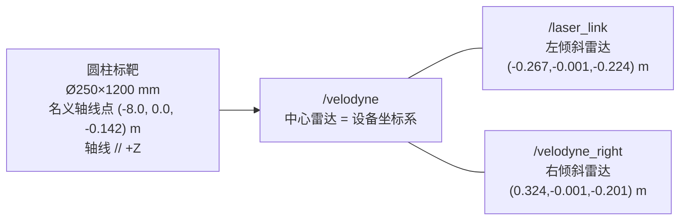

# 掘进设备三路十六线激光雷达圆柱标靶 XY 位移实时测量落地方案

## 执行摘要

你当前的约束其实已经把方案空间收得很清楚了：三路已标定的十六线机械式激光雷达中，一路水平、两路倾斜；标靶只能是圆柱体；当前没有 IMU；输出目标只关心设备相对标靶在 X、Y 两个方向的位移。基于这些条件，最稳妥、最容易直接落地到工程代码的路线，不是“做一个通用 SLAM”，而是把系统定义成**面向单个已知圆柱标靶的多雷达目标定位器**：三路 `PointCloud2` 先按时间戳同步，再通过你给出的外参统一到中心雷达 `/velodyne` 坐标系，在一个受控的后方 ROI 内完成去噪、聚类、鲁棒圆柱拟合和最小二乘精修，最后输出目标圆柱轴线在参考高度处的中心点 \((x_t,y_t)\)，再与基准工位下的 \((x_0,y_0)\) 做差，得到设备位移 \(\Delta X=x_0-x_t,\ \Delta Y=y_0-y_t\)。这样做的好处是计算链短、时延可控、实现边界清晰，而且与 PCL 现成的圆柱分割、RANSAC、法向估计、聚类、滤波组件高度一致。VLP-16 这类十六线雷达在 5–20 Hz 间工作，垂直视场约 30°、垂直分辨率约 2°、水平分辨率随转速约为 0.1°–0.4°，典型精度 3 cm；对运动畸变，文献与厂商资料都明确指出十赫兹扫描一圈约 100 ms，在设备运动时需要做去畸变，否则点云会被拉伸、弯曲，影响拟合稳定性。citeturn5view2turn12view0turn13view0turn22view0turn15search4

在标靶尺寸上，我的**默认推荐值**是 **直径 250 mm、高度 1200 mm**；如果现场粉尘重、振动大、后方结构遮挡多，则把直径增加到 **300 mm、高度仍为 1200 mm** 更稳。默认安装位置建议以中心雷达 `/velodyne` 直接作为设备坐标系，在**基准工位**下把圆柱轴线放在设备后方中心线上，名义位置设为 **\((-8.0,\ 0.0,\ -0.142)\) m**，轴线方向与设备 \(+Z\) 平行；其中 \(-0.142\) m 不是拍脑袋，而是按你给出的外参，三台雷达在中心坐标系中的平均 \(z\) 值计算得到，有利于让三路视线都落在圆柱中段，提高点数利用率。按十赫兹工作、名义距离八米估算，Ø250×1200 mm 的圆柱对中心雷达可提供约 38 个理论命中点/帧，三雷达融合后通常可得到 60–90 个有效内点，足以支撑“RANSAC 粗定位 + 正交距离最小二乘精修 + 常速度卡尔曼滤波”的组合。在**小偏航、低速、无遮挡**的前提下，工程上可以把目标定为：静态 RMS 约 10–20 mm、动态 RMS 约 20–30 mm、十赫兹输出、端到端延迟约 120–140 ms。这里的“动态可用区间”建议限定为线速度不高于 0.5 m/s、偏航角速度不高于 5°/s；超过这个范围，没有 IMU 时常速度去畸变会明显变脆。citeturn5view2turn13view0turn14view0turn8search0

同时必须把一个几何事实说透：**单个圆柱标靶在几何上不提供绕圆柱轴的朝向观测**。因此，在**没有 IMU、也没有第二个非对称标靶**的前提下，本方案可以稳定输出的是“标靶圆柱中心在设备坐标系中的 \(x_t,y_t\)”以及相对基准工位的差分 \(\Delta X,\Delta Y\)；只要设备的偏航变化足够小，这个输出就等价于你关心的平面位移。但如果你后续想把结果严格表达成“标靶固定世界坐标系下的绝对 X/Y 位移”，或者设备会有较明显转向，那就不是“算法调一调”能解决的问题，而是可观测性本身不够，届时需要加 IMU，或增加第二个能够打破旋转对称性的标靶。

## 设计目标与约束

先把边界条件固定下来，后面所有设计都围绕这个清单展开。

| 约束项 | 当前状态 | 设计处理 |
|---|---|---|
| 雷达数量与类型 | 3 路十六线机械式雷达 | 采用三雷达融合，但以中心雷达为主、倾斜雷达为辅 |
| 标定状态 | 已标定 | 直接使用你提供的外参与 ROS 静态 tf 示例，不再重新标定 |
| 标靶形状 | 仅允许圆柱体 | 只设计直径、高度、安装位置与轴线姿态 |
| 输出量 | 重点是 X、Y 位移 | 不追求 yaw 角输出；yaw 在单圆柱下天然不充分 |
| IMU | 当前无；后续可加 | 当前采用无 IMU 常速度去畸变与 CV-KF；接口预留 IMU 融合 |
| 雷达安装关系 | 已给 LEFT/RIGHT→CENTER 外参 | 运行时统一变换到 `/velodyne` 中心坐标系 |
| 设备本体几何外形 | 未指定 | 安装位置采用“名义值 + 现场视线复核”双阶段方式 |
| 目标材料、表面处理 | 未指定 | 算法以几何为主，不把强反射/反射率当作必需条件 |
| 硬件时间同步方式 | 未指定 | 软件层使用时间戳同步，优先读取硬件时戳字段，预留左右时间偏移参数 |
| 设备坐标系定义 | 未指定 | 直接把中心雷达 `/velodyne` 作为设备坐标系；若后续存在 `base_link`，只需再加一条静态 tf |

ROS 的 `PointCloud2` 消息自带采集时间与坐标系帧号，这正好适合做三雷达时间对齐与 tf 变换；`message_filters` 提供基于时间戳的同步策略，适合把三路点云收敛到一个回调中处理。对于你这种任务，**先把三路点云严格对齐到一个中心坐标系，再做目标级拟合**，比先各自检测后再做对象级融合更稳，也更容易调参。citeturn22view6turn22view5

在运行策略上，建议把系统明确拆成两个阶段。第一阶段是**基准工位建零**：设备停稳、雷达预热后，连续采集 3–5 秒静态数据，拟合出高置信的圆柱中心线，保存为 \((x_0,y_0,z_0,u_0)\)。第二阶段是**在线差分输出**：在线每帧只求当前圆柱中心线，再与基准工位结果做差。这种做法有两个优点：一是把“绝对安装误差”转化为“相对变化量”，工程上更抗系统偏置；二是能自然兼容“后续换标靶站点”的工况——重新建零即可。VLP-16 相关研究还建议在高精度使用前预热约 30 分钟，以减小热稳态之前的测量波动，这一步应该放到建零之前。citeturn5view2

## 标靶尺寸与安装建议

标靶尺寸的本质，不是“大一点就一定更好”，而是要在**点云密度、遮挡体积、安装便利和目标唯一性**之间取平衡。对水平安装的十六线雷达，圆柱的直径主要决定水平方向能拿到多少个离散采样列，圆柱的高度主要决定垂直方向能跨过多少条激光线。按 VLP-16 常用十赫兹工作点估算，水平分辨率大约取 0.2°，垂直分辨率约 2°；在八米名义距离下，直径 250 mm 的圆柱横向张角约 1.79°，高度 1200 mm 的圆柱纵向张角约 8.58°，因此中心雷达单帧理论上大约能得到 9 个水平方向采样列、4–5 个垂直方向通道命中，合计约 38 个命中点。由于十六线扫描本身存在非均匀覆盖，实际命中点数会围绕这个理论值上下波动，因此尺寸不能卡得太小。citeturn5view2turn8search0

| 圆柱尺寸 | 八米处中心雷达理论点数/帧 | 视野遮挡影响 | 运动中鲁棒性 | 工程预期性能 | 结论 |
|---|---:|---|---|---|---|
| Ø200 × 1000 mm | ≈ 26 | 低 | 中 | 静态 15–25 mm；动态 25–40 mm | 仅在空间极紧张时使用 |
| **Ø250 × 1200 mm** | **≈ 38** | **低到中** | **高** | **静态 10–20 mm；动态 20–30 mm** | **默认推荐** |
| Ø300 × 1200 mm | ≈ 46 | 中 | 很高 | 静态 8–15 mm；动态 15–25 mm | 粉尘/振动增强推荐 |
| Ø350 × 1200 mm | ≈ 54 | 中到高 | 很高 | 静态 8–15 mm；动态 15–25 mm | 除非空间充裕，否则不划算 |
| Ø300 × 1500 mm | ≈ 58 | 中到高 | 很高 | 静态 8–15 mm；动态 15–25 mm | 高度收益有限，安装负担更大 |

上表中的点数是按中心雷达在八米距离、十赫兹转速下的理论值估算，目的是做设计比较，不是替代现场测试。它的来源是 VLP-16 的角分辨率与扫描周期，而不是经验猜测。由于 fan-style 十六线雷达的回波密度并不均匀，过小目标在某些方位会出现“看得到但点不够”的边缘工况，所以**默认值不建议低于 Ø250 × 1200 mm**。如果现场振动明显、粉尘重、或者你希望在 10–12 m 的距离区间也尽量维持稳定，则提高到 **Ø300 × 1200 mm** 更有把握。citeturn5view2turn8search0

安装位置方面，建议**把中心雷达 `/velodyne` 直接作为设备坐标系**，因为你已经给出了左右雷达到中心雷达的外参，而设备的独立 `base_link` 目前未指定。按照常见车体约定，这里把设备“后方”先定义为 \(-X\) 方向；如果你当前驱动的 `/velodyne` 实际后方是 \(+X\)，则只需要把下面建议中的 \(x\) 符号整体反过来，算法本身不变。名义建议如下。

| 项目 | 建议值 | 理由 |
|---|---|---|
| 设备坐标系 | `/velodyne` | 直接复用已知标定中心，减少额外一层未知误差 |
| 圆柱轴线方向 | \((0,0,1)\) | 只关心平面位移时，竖直轴线最利于差分定义与现场安装 |
| 基准工位轴线点 | **\((-8.0,\ 0.0,\ -0.142)\) m** | 八米兼顾点密度与遮挡；\(y=0\) 最小化左右耦合；\(z=-0.142\) 对应三雷达平均高度 |
| 推荐工作距离 | 5–10 m | 点数与遮挡权衡最佳区间 |
| 可接受退化距离 | 10–12 m | 仍可工作，但点数和动态鲁棒性下降 |
| 超限策略 | 超过 12 m 重新布设标靶并重新建零 | 小直径十六线目标在更远处点数下降明显，不适合硬扛 |

如果把推荐尺寸定为 Ø250 × 1200 mm，那么以上安装位置下，圆柱顶部和底部分别位于中心雷达 \(z\) 方向的约 \(+0.458\) m 和 \(-0.742\) m，相当于在八米距离上覆盖大约 \(-5.3^\circ\) 到 \(+3.3^\circ\) 的垂直夹角，正好落在十六线雷达的有效垂直视场内部，并覆盖 4–5 条垂直 channel，是比较理想的工作点。



这里还有一个必须落地执行的现场规则：由于设备后部真实包络尺寸未指定，**名义安装值只是第一版设计值**。最终安装前，要在 RViz 中看三路点云投到 `/velodyne` 后，中心雷达至少能在静态下连续获得 30 个以上有效目标点/帧；如果某一路倾斜雷达发生长期遮挡，优先微调标靶高度，再考虑微调纵向距离，最后才动横向位置。

## 多雷达观测几何分析

从你给出的外参直接计算，可以得到几个对设计很关键的量。第一，左右两台倾斜雷达在中心坐标系中的平移基线大约是 **0.591 m**，这意味着它们看到的是同一根圆柱的不同入射截面，而不是简单的“重复拍一遍”。第二，两台倾斜雷达相对中心雷达在 \(z\) 方向分别偏低约 **0.224 m** 和 **0.201 m**，这使得它们更容易补到中心雷达在下半部或侧半部的稀疏区域。第三，如果把你给出的旋转矩阵按局部 \(z\) 轴相对中心 \(Z\) 轴的夹角去看，两台倾斜雷达的安装倾角量级都在 **55.5° 左右**，说明它们不是轻微辅助视角，而是明显改变了圆柱侧壁入射角的“互补视角”。这正是三雷达布局对单体圆柱目标有价值的地方：中心雷达给出最稳定的几何主观测，倾斜雷达给出在遮挡、车体俯仰、局部稀疏时的补点。对不完整、带外点的圆柱点云，鲁棒圆柱拟合文献也明确说明，“部分圆柱 + 离群点”是常见难点，不能把问题当作理想全圆柱来做。citeturn14view0

转速选择也必须算清楚。VLP-16 这类雷达的水平分辨率会随转速变化，在 5–20 Hz 范围内大约从 0.1° 变到 0.4°。对你的目标，不应一味追求更高刷新率，因为圆柱本身很小，水平采样列一旦太少，拟合方差会急剧上升。以 Ø250 × 1200 mm、八米距离为例：

| 转速 | 估算水平分辨率 | 成帧时间 | 八米处中心雷达理论目标点数/帧 | 评价 |
|---|---:|---:|---:|---|
| 5 Hz | 0.1° | 200 ms | ≈ 77 | 点数很好，但时延偏大，运动畸变加重 |
| **10 Hz** | **0.2°** | **100 ms** | **≈ 38** | **密度与时延平衡最好，推荐** |
| 20 Hz | 0.4° | 50 ms | ≈ 19 | 时延小，但目标太稀，容易抖动和丢失 |

这就是为什么本方案推荐 **10 Hz**：二十赫兹虽然半圈只要 50 ms，但目标会变得过稀；五赫兹虽然点密度最好，但一帧 200 ms 对运动中目标会带来更强扫描畸变。相关研究和厂商资料都指出，机械式 spinning lidar 的点云在运动时会因为“不同点采样时刻不同”而出现变形，因此只看“刷新率高”是不够的，必须同时看单帧点数和畸变代价。citeturn5view2turn12view0turn13view0

盲区分析上，还要补一个现实问题：十六线雷达的覆盖并非均匀铺满，VLP-16 的 scan pattern 研究指出，在典型运动参数下会出现局部脉冲覆盖较差的区域。也正因如此，本方案把中心雷达定义为**主观测源**，把倾斜雷达定义为**补观测源**，并建议目标尺寸不要小于 Ø250 mm。三路融合以后，理论上目标的内点数可比中心单雷达提高约 1.5–2.3 倍，但实际提升取决于设备后部遮挡、时序同步和两台倾斜雷达的真实后方可视扇区，所以现场必须以 RViz 和 rosbag 回放做最终确认。citeturn8search0turn8search4

## 实时点云处理与圆柱拟合算法

算法流程建议做成“**中心主导、融合增强、两阶段拟合**”的结构。所谓中心主导，是指任何时候都优先保证中心雷达单独就能给出稳定候选；左右倾斜雷达的点云只有在 tf 和时间同步都通过一致性检查后，才用于增加内点数和提高置信度。这样即使用现场发现其中一台倾斜雷达视线不理想，系统也不会整套失效。

从实现顺序上看，推荐以下处理链：

```mermaid
flowchart LR
  A["3 路 PointCloud2"] --> B["时间同步\nmessage_filters"]
  B --> C["变换到 /velodyne\n使用静态 tf"]
  C --> D["无 IMU 去畸变\n常速度模型"]
  D --> E["动态 ROI 裁剪\nPassThrough + VoxelGrid + SOR"]
  E --> F["地面/支撑面剔除\nPlane RANSAC"]
  F --> G["欧式聚类"]
  G --> H["候选筛选\n半径/高度/先验位置"]
  H --> I["圆柱粗拟合\nRANSAC + normals"]
  I --> J["圆柱精修\nODR/最小二乘"]
  J --> K["取 z*=z0 处轴线中心点"]
  K --> L["CV-KF + 质量评估"]
  L --> M["/target_xy /equipment_state /diagnostics /marker"]
```



这条链和 PCL 的推荐用法是一致的：`PassThrough` 用于基于字段范围做快速裁剪；`VoxelGrid` 用体素网格下采样并保留体素质心；`StatisticalOutlierRemoval` 通过邻域统计剔除稀疏外点；`NormalEstimation` 计算法向；`EuclideanClusterExtraction` 负责把散乱点云分成候选簇；对平面或支撑结构可先做一次 RANSAC 平面剔除；然后再用带法向约束的圆柱样本一致性模型做粗拟合。PCL 的圆柱示例本身就是“先滤波、估法向、去平面、再分圆柱”，这和你的目标非常匹配。citeturn22view0turn22view1turn22view2turn22view3turn22view4turn24view0turn24view1

建议使用的数学形式如下。设某时刻三路点云统一到中心雷达坐标系后的目标内点集合为 \(\mathcal{P}=\{p_i\}\)。圆柱模型用“轴线上一点 \(\mathbf{p}_0\)、轴向量 \(\mathbf{u}\)、半径 \(r\)”表示，粗拟合阶段用 RANSAC 在外点环境下找一组内点，优化目标可以写成：

\[
\min_{\mathbf{p}_0,\mathbf{u},r}\ \sum_{i \in \text{inliers}}
\left( \left\| (\mathbf{p}_i-\mathbf{p}_0)-((\mathbf{p}_i-\mathbf{p}_0)\cdot \mathbf{u})\mathbf{u}\right\|-r \right)^2
\]

RANSAC 的作用是在强外点环境下先把“谁是圆柱上的点”找出来；这个思想来自 Fischler 和 Bolles 的原始工作，而针对不完整、局部遮挡的圆柱点云，Nurunnabi 等人又进一步指出，鲁棒 PCA 和鲁棒回归对部分圆柱尤其有价值。因此工程上最稳的做法是：**先用 RANSAC 找内点，再用正交距离最小二乘做精修**，而不是一步到位做纯最小二乘。NIST 的几何拟合工作给了正交距离回归的工程基线。citeturn7search2turn14view0turn15search4

在拟合之后，你真正需要的不是“一个三维圆柱模型对象”，而是**圆柱轴线在某个固定参考高度上的中心点**。因此建议把基准工位的圆柱中心高度记为 \(z^\*=z_0\)，在线每帧拟合出轴线后，取它与平面 \(z=z^\*\) 的交点：

\[
\mathbf{c}_k=\mathbf{p}_0 + \frac{z^\*-p_{0z}}{u_z}\mathbf{u}
\]

然后定义测量量为 \(\mathbf{z}_k=[c_{k,x},c_{k,y}]^\top\)，位移输出定义为

\[
\Delta X=c_{0,x}-c_{k,x},\qquad \Delta Y=c_{0,y}-c_{k,y}
\]

这个定义有两个工程好处。第一，它直接对应你关心的 X、Y 差分量，不需要把圆柱完整姿态长期保留为业务输出。第二，在线拟合允许轴线有轻微倾斜，但最终输出仍在固定参考高度上取中心点，因此对局部噪声和个别离群点更不敏感。

参数初值建议从下面这组开始，而不要一上来就全局搜索：`roi_x=[-12,-4] m`、`roi_y=[-2,2] m`、`roi_z=[z0-1.2,z0+1.0] m`、`voxel_leaf=0.02 m`、`cluster_tol=0.08~0.12 m`、`radius_limits=[0.125±0.03] m`（若默认用 Ø250）、`plane_dist_thresh=0.02 m`、`cylinder_dist_thresh=0.02 m`、`min_inliers_good=25`。如果现场后方的其他立柱、管线也接近圆柱尺寸，则一定要让**位置先验**参与候选筛选：只保留预测位置周围 0.4–0.6 m 内的簇，再做圆柱拟合。

## 无 IMU 位移估计与稳定性设计

没有 IMU 时，系统最核心的挑战不是“能不能拟合到圆柱”，而是“**运动时怎么让输出不跳、不断、不过度滞后**”。对应地，策略也要分两层：一层处理点云本身的运动畸变，另一层处理输出序列的平滑与质量控制。

先看几何可观测性。若设备在世界系的位置为 \(\mathbf{p}_b^W\)，标靶轴线中心在世界系的位置为 \(\mathbf{p}_t^W\)，设备相对世界的偏航为 \(\psi_k\)，那么设备坐标系中看到的目标中心是：

\[
\mathbf{p}_{t}^{B}(k)=R_z(\psi_k)^\top \left(\mathbf{p}_t^W-\mathbf{p}_b^W\right)
\]

这说明只要 \(\psi_k\) 未知，单个圆柱下的 \(\mathbf{p}_{t}^{B}(k)\) 就无法唯一反解出世界系下的 \(\mathbf{p}_b^W\)。所以**当前无 IMU 版本的业务定义必须明确为：输出设备坐标系中的目标中心差分 \(\Delta X,\Delta Y\)**，或者在“小偏航”假设下把它近似看作世界系平面位移。这个前提要写进接口文档和验收标准里，否则后面现场一旦出现明显转向，就会把几何问题误判成算法问题。

点云层面的稳定性，建议做**无 IMU 常速度去畸变**。LOAM 明确指出，机械扫描 lidar 在运动中会因为每个点的采样时间不同而发生点云畸变，并通过高频低精度的里程计先估速度、再做畸变校正；Ouster 的官方说明也把“constant velocity model”列为无 IMU 时的基线方法，并同时提醒这种方法在突发制动、颠簸和急转弯时会失效。基于此，本方案建议：每帧以前一帧滤波后的 \((v_x,v_y,\omega_z)\) 作为先验，对本帧点按相对时间插值回扫到当前参考时刻；如果点云中没有逐点时间字段，则退化为整帧级补偿并严格限制设备运动 envelope。citeturn12view0turn13view0

序列层面的稳定性，建议采用**常速度卡尔曼滤波器 + 创新门控 + 短时保活**。状态可定义为

\[
\mathbf{x}_k=[x,\ y,\ v_x,\ v_y]^\top
\]

量测为

\[
\mathbf{z}_k=[c_x,\ c_y]^\top
\]

过程模型用离散常速度模型，测量协方差不要写死，而是按拟合残差、内点数和三路一致性自适应更新。工程上可以用这套规则：若 `inliers >= 25` 且圆柱残差 RMS 小于 15 mm，则标记 `GOOD`；若 `15 <= inliers < 25` 或残差在 15–30 mm，则标记 `DEGRADED`；若连续 3 帧失配，则标记 `LOST`，但允许用滤波器状态外推保活 0.3 s，避免输出瞬断。这样系统在短时遮挡中不会立刻跳零，但又不会无限漂移。

误差预算可以按下面的步骤算，而不是只看厂家“3 cm 精度”这一条。以默认配置 Ø250×1200、八米距离、十赫兹为例：

\[
e_\theta \approx R \cdot \frac{\delta_h}{\sqrt{12}}
\]

其中 \(\delta_h \approx 0.2^\circ\)，则 \(e_\theta \approx 8.1\) mm。

\[
e_{\text{sync}} \approx v \Delta t
\]

若线速度 \(v=0.5\) m/s，左右雷达同步误差 \(\Delta t=20\) ms，则 \(e_{\text{sync}} \approx 10\) mm。

\[
e_{\text{scan,raw}} \approx vT_s
\]

十赫兹时 \(T_s \approx 0.1\) s，若不做去畸变，则线速度 0.5 m/s 下原始扫描畸变上界可达 50 mm；若按常速度模型去畸变，残差主要受加速度和角速度变化影响，通常会降到 10 mm 量级以内，平稳工况甚至更低。citeturn5view2turn13view0turn12view0

把各项误差写成 RSS 形式更便于和现场对表：

| 误差源 | 估算方式 | 默认工况量级 |
|---|---|---:|
| 距离噪声/残余偏置 | 依据 VLP-16 近距实验与标定后残余 | 10–20 mm |
| 水平量化误差 | \(R\delta_h/\sqrt{12}\) | ≈ 8 mm |
| 三雷达同步误差 | \(v\Delta t\) | ≈ 10 mm |
| 扫描畸变残差 | 常速度去畸变后余项 | 5–10 mm |
| 圆柱拟合残差 | 内点质量相关 | 5–10 mm |
| 外参残余 | 标定后未指定 | 需要现场实测确认 |

如果把外参残余控制在 5 mm 量级，按默认工况做 RSS 合成，**静态 RMS 10–20 mm、动态 RMS 20–30 mm** 是合理的工程目标；如果线速度更高、偏航更大、同步误差更差，动态误差自然会抬升。基于这一点，我建议把当前无 IMU 版本的可用运动 envelope 明确写成：**线速度 ≤ 0.5 m/s，偏航角速度 ≤ 5°/s，且不允许持续冲击或急停**。这不是保守，而是对几何和扫描机制的尊重。

延迟预算也建议明确下来，避免后面“感觉实时”：

| 环节 | 预算 |
|---|---:|
| 扫描成帧 | 100 ms |
| 三路同步等待 | 5–10 ms |
| tf 变换 + ROI 裁剪 + 下采样 | 8–12 ms |
| 平面剔除 + 聚类 + 圆柱拟合 | 8–12 ms |
| KF 更新 + 发布 + 可视化 | 1–3 ms |
| **总计算时延** | **22–35 ms** |
| **端到端输出延迟** | **122–135 ms** |

上表中的计算时延是假设工控机算力处于 x86 四核三吉赫兹量级；具体硬件未指定，因此这部分应在现场用 rosbag 回放做实测 profile，而不是仅按经验估算。

## IMU 扩展与 ROS 实现细节

后续加 IMU 时，不建议重写整套系统，而是保持“**目标检测前端不变，状态估计与去畸变增强**”的思路。最小改造路径是：保留当前的三雷达同步、ROI、聚类、圆柱拟合前端，把 IMU 作为两件事的增强源。第一，用 IMU 的角速度和线加速度做逐点去畸变，提高运动中点云几何质量；第二，把当前仅观测 \((x,y)\) 的 CV-KF 升级为带姿态和偏置的误差状态滤波或小窗口因子图，把“圆柱中心观测”作为外部测量因子接入。LOAM 原文就指出，如果有 IMU，可用它提供高频运动先验；后续的 LiDAR–IMU 紧耦合工作则进一步把 IMU 预积分用于点云去畸变和状态优化。citeturn12view0turn21search0turn21search2

ROS 落地上，建议直接按 ROS1 `catkin` 包组织，但运行时尽量采用 `tf2_ros::Buffer` 与 `tf2_sensor_msgs` 思路来做坐标变换。你给出的静态 tf 示例要**原样进入 launch**，不要再手敲矩阵做二次换算；如果你现场已经有静态 tf 在发布，则直接复用，不要重复发。同样要注意一点：你的 YAML 名称 `LEFT_LiDAR_T_CENTER_LiDAR` 和 `RIGHT_LiDAR_T_CENTER_LiDAR` 与 `static_transform_publisher` 的父子语义在文字上可能会让人混淆，所以**运行时以 tf 树为唯一真值**，不要在业务代码里再单独解释一遍矩阵语义。ROS 的静态 tf 工具本来就是用来固定这种不随时间变化的坐标关系的。citeturn18search0turn6search2

当前仓库的节点结构如下：

| 节点 | 订阅 | 发布 | 职责 |
|---|---|---|---|
| `multi_lidar_fusion_node` | 2/3 路 TM16 点云、`/tf` | `/points_raw` | 时间同步、坐标统一、融合点云发布 |
| `target_localizer_node` | `/points_raw` | `/target_measurement`、`/target_xy`、`/target_cloud_roi`、`/target_marker` | ROI、滤波、圆柱拟合、目标跟踪 |
| `equipment_state_node` | `/points_raw` | `/equipment_state` | 从当前点云估计俯仰角、横滚角、偏航角和四角距离 |
| `modbus_sensor_reference_node` | MODBUS TCP | `/sensor_reference` | 接入惯导和 4 路毫米波真实参考值 |
| `mine_web_bridge_node` | 点云、路径、`/equipment_state`、`/sensor_reference` | WebSocket | 浏览器驾驶舱的数据桥接 |

配套的话题建议如下：

| 话题 | 类型 | 说明 |
|---|---|---|
| `/points_raw` | `sensor_msgs/PointCloud2` | 三雷达融合后的统一点云，定位节点默认订阅它 |
| `/target_measurement` | 自定义 `TargetMeasurement.msg` | 原始测量值、残差、内点数、协方差 |
| `/target_xy` | 自定义 `TargetXY.msg` | 最终输出的 \(\Delta X,\Delta Y\) 与状态 |
| `/equipment_state` | 自定义 `EquipmentState.msg` | 点云计算出的姿态角和左前、左后、右前、右后距离 |
| `/sensor_reference` | 自定义 `EquipmentState.msg` | MODBUS TCP 接入的惯导和 4 路毫米波真实值 |
| `/target_marker` | `visualization_msgs/Marker` | 圆柱轴线与中心点可视化 |
| `/diagnostics` | `diagnostic_msgs/DiagnosticArray` | 质量评估 |

`equipment_state_node` 的四角距离通过 `front_sample_distance_m` 和
`rear_sample_distance_m` 配置前/后测量截面；`forward_sign` 和 `left_sign`
用于适配现场坐标方向。Web 驾驶舱左侧显示 `/equipment_state` 的点云计算值，
右侧显示 `/sensor_reference` 的真实传感器值，两路数据不互相覆盖。

静态 tf 的 launch 片段建议直接写成这样：

```xml
<launch>
  <node pkg="tf" type="static_transform_publisher" name="center_to_left"
        args="-0.267094 -0.000706537 -0.224038 1.57928 0.0331277 -0.97384 /velodyne /laser_link 10" />
  <node pkg="tf" type="static_transform_publisher" name="center_to_right"
        args="0.323744 -0.00124153 -0.200876 3.08919 2.17349 3.12012 /velodyne /velodyne_right 10" />
</launch>
```

主算法伪代码可以直接按下面的结构交给开发或编码代理实现：

```cpp
void TargetLocalizer::callback(
    const sensor_msgs::PointCloud2ConstPtr& pc_center,
    const sensor_msgs::PointCloud2ConstPtr& pc_left,
    const sensor_msgs::PointCloud2ConstPtr& pc_right)
{
    // 1) tf 到 /velodyne
    Cloud C = tfToCenterAndDeskew(pc_center, state_pred_);
    Cloud L = tfToCenterAndDeskew(pc_left,   state_pred_);
    Cloud R = tfToCenterAndDeskew(pc_right,  state_pred_);

    // 2) 动态 ROI（先用预测值缩窗口，再做常规 pass-through）
    C = cropAndFilter(C, roi_from_prediction_);
    L = cropAndFilter(L, roi_from_prediction_);
    R = cropAndFilter(R, roi_from_prediction_);

    // 3) 融合与结构剔除
    Cloud merged = mergeClouds(C, L, R);
    Cloud denoised = voxelAndSOR(merged);
    Cloud nonground = removePlaneIfNeeded(denoised);

    // 4) 聚类 -> 候选筛选
    auto clusters = euclideanClusters(nonground);
    Cluster best = selectByPrior(clusters, nominal_radius_, nominal_height_, state_pred_);

    // 5) 圆柱拟合：RANSAC 粗拟合 + ODR 精修
    CylinderModel coarse = fitCylinderRANSAC(best);
    CylinderModel refined = refineCylinderODR(coarse.inliers);

    // 6) 取参考高度 z_ref 处的轴线中心点
    Eigen::Vector3d center_pt = linePlaneIntersection(refined.axis_point, refined.axis_dir, z_ref_);

    // 7) 计算差分位移
    Measurement z;
    z.cx = center_pt.x();
    z.cy = center_pt.y();
    z.dx = x0_ - z.cx;
    z.dy = y0_ - z.cy;
    z.cov = estimateCovariance(refined.residual_rms, refined.inlier_count);

    // 8) 跟踪滤波与状态机
    TrackerOutput out = tracker_.update(z);

    publishMeasurement(z);
    publishOutput(out);
    publishDiagnostics(refined, out);
}
```

如果你提到的 “codx” 指的是 **OpenAI Codex**，那么上述工程结构非常适合直接交给 Codex 落地，因为官方资料明确说明 Codex 可以在 IDE、CLI 或云端读取、编辑、运行代码，并承担从实现到测试的实际工程任务。为了让它更顺手，交付仓库中应包含清晰的 `README`、一条命令即可启动的 launch、参数文件、测试数据和预期输出样例。citeturn19search0turn19search2turn19search3

## 测试验证与交付清单

验证计划不能只做“静态看着对”，要把**静态、动态、退化、边界和复现实验**都拉齐。建议的测试矩阵如下：

| 测试场景 | 做法 | 关键指标 | 目标 |
|---|---|---|---|
| 静态标定验证 | 5、8、10、12 m 各采 30 s 静态数据 | 绝对误差、重复性、内点数 | 5–10 m 绝对误差 ≤ 20 mm；12 m ≤ 35 mm |
| 直线运动 | 设备沿 X 方向匀速移动 0.1/0.3/0.5 m/s | RMS、时延、丢帧率 | RMS ≤ 30 mm；输出频率 10 Hz；丢帧 < 1% |
| 横向运动 | 设备沿 Y 方向移动 ±0.3 m | 横向耦合、滤波稳定性 | RMS ≤ 30 mm；无明显过冲 |
| 短时遮挡 | 遮挡目标 30% / 50% 可见面积 | 检出率、恢复时间 | 30% 遮挡检出率 ≥ 95%；恢复 < 0.5 s |
| 振动/发动机工况 | 开机、液压振动下连续运行 | 跳变峰值、状态标志 | 无 > 50 mm 的离群跳变；状态及时降级 |
| 热稳态 | 冷启动与预热后重复静态测量 | 漂移 | 预热后均值更稳；记录热漂移曲线 |
| 偏航扰动表征 | 固定位置下施加小偏航 | 差分变化趋势 | 形成“无 IMU 有效偏航范围”结论，写入说明书 |

测试数据记录建议至少保留这些话题：三路原始点云、`/tf`、`/tf_static`、中间 ROI 点云、目标测量、滤波输出、质量诊断。所有验证都必须支持 **rosbag 回放复现**，因为这会大幅降低后续调参与问题定位成本。地面真值可以用全站仪、激光跟踪仪、直线滑台、测距尺 + 静态标定治具等任一种，只要误差量级优于系统目标即可；具体设备目前未指定。

交付物建议按“代码、参数、数据、报告、自动化脚本”五类组织，而不是只给一堆源码：

| 交付物 | 内容 | 目的 |
|---|---|---|
| 代码包 | `target_localizer` ROS1 `catkin` 包源码 | 直接编译运行 |
| Launch | `bringup.launch`、`offline_replay.launch` | 一键上线与一键回放 |
| 配置 | `target_localizer.yaml`、`extrinsics.yaml`、`roi.yaml` | 明确所有可调参数和默认值 |
| 消息定义 | `TargetMeasurement.msg`、`TargetXY.msg`、`EquipmentState.msg` | 固化接口，方便上层调用 |
| 测试数据 | 至少 3 组 rosbag：静态、动态、遮挡 | 复现与 regression test |
| 可视化 | RViz 配置、Marker 发布 | 现场联调 |
| 评估脚本 | `eval_xy.py`、CSV 导出、误差统计图 | 量化验收 |
| 报告 | PDF 版设计说明、参数表、测试结论 | 现场交底与归档 |
| 自动化脚本 | `make_release.sh`、`send_report_gmail.py` | 打包与邮件交付 |
| 使用说明 | `README.md` | 给开发、运维、编码代理直接使用 |

如果需要把最终方案**自动发送到谷歌邮箱**，建议把这一步也作为交付物，而不是人工操作。Gmail API 官方文档给出的标准做法是：按 MIME/RFC 2822 构造邮件，把原始消息做 base64URL 编码，放入 `raw` 字段，然后调用 `users.messages.send`；授权范围可使用 `gmail.send`。因此你完全可以把最终发布流程做成：`make_release.sh` 生成 zip 和 PDF，`send_report_gmail.py` 读取配置后自动发送到目标 Gmail。这样做既能自动化，也便于纳入 Codex 或 CI 流水线。citeturn11search2turn11search4turn11search6

最后，把“可直接交付到 codx 落地”的要求具体化，就是让仓库满足四个条件：**有清晰目录结构、有默认参数、有可复现测试、有一键运行入口**。如果交付包达到这一点，不管是人、Codex 还是你自己的工程团队，接手成本都会明显降低；而邮件自动发送则作为发布链的最后一步，独立于算法主体，不会把核心定位链条搞复杂。citeturn19search0turn19search3turn11search2
